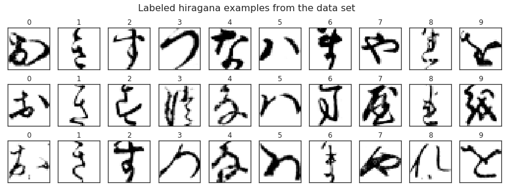
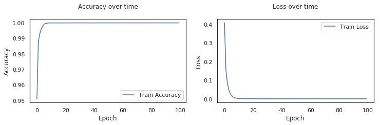
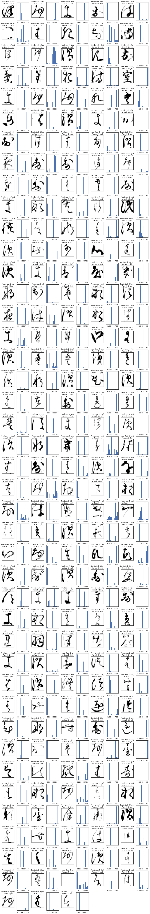

# Ancient hiragana recognition with a Convolutional Neural Network
*Loïc Gauthier*

In this kernel, we'll take a look at the K-MNIST data set. It is composed of 70,000 28x28 pictures of ancient hiraganas in greyscale. Our goal is to associate each image to one of 10 modern hiraganas.

In order to do so, we will use a Convolutional Neural Network.

# 0. Imports


```python
#Easy data manipulation
import pandas as pd
import numpy as np

#Plotting
import seaborn as sns
sns.set(style='white', context='notebook', palette='deep')
import matplotlib.pyplot as plt

#Who likes warnings anyway?
import warnings
warnings.filterwarnings('ignore')

#Sklearn stuffs
from sklearn.preprocessing import StandardScaler
from sklearn.neighbors import KNeighborsClassifier
from sklearn.metrics import classification_report
from sklearn.model_selection import StratifiedKFold

#Keras stuffs
import keras
from keras.models import Sequential
from keras.layers import Dense, Dropout, Flatten, BatchNormalization, Activation, Conv2D, MaxPooling2D, AveragePooling2D
from keras.optimizers import Adadelta

#Math
from math import ceil

#Time to measure runtime
from time import time
```

    Using TensorFlow backend.
    

# 1. Loading the images and class map


```python
#Tells us which class is associated with which modern hiragana
classmap = pd.read_csv('../input/kmnist_classmap.csv')

#The set is already split in a training and a testing set, and has separated labels
train_images = np.load('../input/kmnist-train-imgs.npz')['arr_0']
test_images = np.load('../input/kmnist-test-imgs.npz')['arr_0']
train_labels = np.load('../input/kmnist-train-labels.npz')['arr_0']
test_labels = np.load('../input/kmnist-test-labels.npz')['arr_0']
```


```python
print("KMNIST train shape:", train_images.shape)
print("KMNIST test shape:", test_images.shape)
print("KMNIST train shape:", train_labels.shape)
print("KMNIST test shape:", test_labels.shape)

#Adding hiragana's romaji to the class map for convenient display
romaji = ["o", "ki", "su", "tsu", "na", "ha", "ma", "ya", "re", "wo"]
classmap['romaji'] = romaji
print("\nKMNIST class map shape:", classmap.shape)
print('\nClass map:\n', classmap)
```

    KMNIST train shape: (60000, 28, 28)
    KMNIST test shape: (10000, 28, 28)
    KMNIST train shape: (60000,)
    KMNIST test shape: (10000,)
    
    KMNIST class map shape: (10, 4)
    
    Class map:
        index codepoint char romaji
    0      0    U+304A    お      o
    1      1    U+304D    き     ki
    2      2    U+3059    す     su
    3      3    U+3064    つ    tsu
    4      4    U+306A    な     na
    5      5    U+306F    は     ha
    6      6    U+307E    ま     ma
    7      7    U+3084    や     ya
    8      8    U+308C    れ     re
    9      9    U+3092    を     wo
    

The training set contains 60,000 28x28 pictures, associated with 10 possible modern hiraganas. The test set contains 10,000 instances.

Let's see if the classes repartition is balanced in the train set as well as in the data set.


```python
Classes_proportion_train = [len(train_images[np.where(train_labels == i)])/len(train_images)*100 for i in range(len(classmap))]
Classes_proportion_test = [len(test_images[np.where(test_labels == i)])/len(test_images)*100 for i in range(len(classmap))]

print("----- PROPORTION OF CLASSES IN TRAINING SET -----\n")
for i in range(len(classmap)):
    print("Proportion of class {0}: {1}%". format(i, Classes_proportion_train[i]))

print("\n----- PROPORTION OF CLASSES IN TEST SET -----\n")
for i in range(len(classmap)):
    print("Proportion of class {0}: {1}%". format(i, Classes_proportion_test[i]))

```

    ----- PROPORTION OF CLASSES IN TRAINING SET -----
    
    Proportion of class 0: 10.0%
    Proportion of class 1: 10.0%
    Proportion of class 2: 10.0%
    Proportion of class 3: 10.0%
    Proportion of class 4: 10.0%
    Proportion of class 5: 10.0%
    Proportion of class 6: 10.0%
    Proportion of class 7: 10.0%
    Proportion of class 8: 10.0%
    Proportion of class 9: 10.0%
    
    ----- PROPORTION OF CLASSES IN TEST SET -----
    
    Proportion of class 0: 10.0%
    Proportion of class 1: 10.0%
    Proportion of class 2: 10.0%
    Proportion of class 3: 10.0%
    Proportion of class 4: 10.0%
    Proportion of class 5: 10.0%
    Proportion of class 6: 10.0%
    Proportion of class 7: 10.0%
    Proportion of class 8: 10.0%
    Proportion of class 9: 10.0%
    

For both the training and the test set, the proportion of each class is perfectly balanced.

# 2. A first look at the test set


```python
figure = plt.figure(figsize=(15,5))
figure.suptitle('Labeled hiragana examples from the data set', fontsize=16)
for lab in range(len(classmap)):
    images = train_images[np.where(train_labels == lab)]
    labels = train_labels[np.where(train_labels == lab)]
    for inst in range(3):
        
        #Make a grid of 10x3. Each line will receive the 3 first example of one of the 10 classes
        plt.subplot(3,10,1 + lab + (inst * 10)) #Be careful with the subplot index, it begins at 1, not 0
        
        #Plot image with label as title
        plt.imshow(images[inst], cmap=plt.cm.Greys) #We use grayscale for readability
        plt.title(labels[inst]) 
        #We can't display the computer-version if the modern hiragana as the plots' title
        #matplotlib doesn't seem to support these characters
        
        #Formatting: no grid, no ticks
        plt.grid(False)
        plt.xticks(ticks=[])
        plt.yticks(ticks=[])
            
plt.show()
```





We can already see in that small sample that there is apparently a lot of variance in the shapes inside each class of hiragana. For instance, from a very naive point of view, it seems that the second and third member of the 9th class are very different from each other.

# 3. A first simple classification: kNN

In order to use the kNN classifier, we first have to flatten the 28x28 pictures into a single array with 784 elements.


```python
flat_image_train = np.reshape(train_images, (60000, -1))
flat_image_test = np.reshape(test_images, (10000, -1))
```

Then we know that kNN classifier tend to give better results on normalized data. So let's fit a scaler on the training data, and transform both the training and the test set with that scaler.


```python
ss = StandardScaler()
flat_image_train = ss.fit_transform(flat_image_train)
flat_image_test = ss.transform(flat_image_test)
```


```python
start = time()
knn = KNeighborsClassifier(n_neighbors=4, n_jobs=-1)
knn.fit(flat_image_train, train_labels)
y_predicted = knn.predict(flat_image_test)
end = time()

print(classification_report(test_labels, y_predicted))
print("kNN accuracy: {0:.2f}%".format(knn.score(flat_image_test, test_labels)))
print("kNN took {0:.2f} seconds to perform fit and predict.".format(end-start))
```

                  precision    recall  f1-score   support
    
               0       0.88      0.90      0.89      1000
               1       0.88      0.92      0.90      1000
               2       0.79      0.86      0.83      1000
               3       0.85      0.94      0.89      1000
               4       0.92      0.83      0.87      1000
               5       0.91      0.90      0.91      1000
               6       0.91      0.91      0.91      1000
               7       0.97      0.84      0.90      1000
               8       0.86      0.91      0.88      1000
               9       0.94      0.86      0.90      1000
    
       micro avg       0.89      0.89      0.89     10000
       macro avg       0.89      0.89      0.89     10000
    weighted avg       0.89      0.89      0.89     10000
    
    kNN accuracy: 0.89%
    kNN took 587.70 seconds to perform fit and predict.
    

The kNN classifier gives us a good baseline before using better methods. Here we can see that kNN (with k=4) took roughly 10 minutes to fit  and predict the classes of our test set. It gives rather good results given the simplicity of the method, with a weighed average f1-score of 0.89.

# 4. A better approach: Convolutional Neural Networks

Convolutional neural networks are particularly used for image recognition as they respect the spatial repartition of the pixels of input pictures and to not require them to be flattened.

The most common architectures for ConvNet used for simple classifications like CIFAR-10 are the following:
* Input -> Conv2d -> ReLU -> Fully Connected;
* Input -> (Conv2d -> ReLU -> Pooling)x2 -> Fully Connected -> ReLU -> Fully Connected;
* Input -> (Conv2d -> ReLU -> Conv2d -> ReLU -> Pooling)x3 -> (Fully Connected -> ReLU)x2 -> Fully Connected

It is also good practise to use drop out steps to prevent the activation of a certain proportion of neurons (regardless of their input) in order to avoid overfitting. Although, in this case, as we will use Batch normalization, we will introduce some noise in the network that will have the side effect to help with regularization. Batch normalization will be mainly used for faster training, eliminate covariate shift, and to have less sensibility to possibly bad randomly initialized weights. Another thing to consider is 0 padding to ensure that all regions of the pictures get sampled the same number of time through our convolution layers.

Let's get into it and reshape our pictures so that they are 28x28x1 arrays, and define our labels to keras.


```python
x_train = np.reshape(train_images, (60000, 28, 28,1))  
y_train = keras.utils.to_categorical(train_labels, num_classes=len(classmap))
x_test = np.reshape(test_images, (10000, 28, 28,1))
y_test = keras.utils.to_categorical(test_labels, num_classes=len(classmap))
```

We implement the architecture Input -> (Conv2d -> ReLU -> Conv2d -> ReLU -> Pooling)x3 -> (Fully Connected -> ReLU)x2 -> Fully Connected


```python
def GetMyConvNet():
    model = Sequential()

    model.add(Conv2D(32, (3, 3), strides=(1,1), padding="same", input_shape=(28, 28,1)))
    model.add(BatchNormalization())
    model.add(Activation('relu'))

    model.add(Conv2D(32, (3, 3), strides=(1,1), padding="same"))
    model.add(BatchNormalization())
    model.add(Activation('relu'))

    model.add(MaxPooling2D(pool_size=(2, 2))) 
    #model.add(Dropout(0.25))

    model.add(Conv2D(62, (3, 3), strides=(1,1), padding="same"))
    model.add(BatchNormalization())
    model.add(Activation('relu'))
    model.add(Conv2D(62, (3, 3), strides=(1,1), padding="same"))
    model.add(BatchNormalization())
    model.add(Activation('relu'))

    model.add(MaxPooling2D(pool_size=(2, 2)))
    #model.add(Dropout(0.25))

    model.add(Conv2D(96, (3, 3), strides=(1,1), padding="same"))
    model.add(BatchNormalization())
    model.add(Activation('relu'))

    model.add(Conv2D(96, (3, 3), strides=(1,1), padding="same"))
    model.add(BatchNormalization())
    model.add(Activation('relu'))

    model.add(AveragePooling2D(pool_size=(2, 2)))
    #model.add(Dropout(0.25))

    model.add(Flatten())
    model.add(Dense(384, activation='relu'))
    model.add(Dense(192, activation='relu'))
    #model.add(Dropout(0.5))
    model.add(Dense(10))
    model.add(BatchNormalization())
    model.add(Activation('softmax'))

    adadelta = Adadelta(lr=1, rho=0.95, epsilon=None, decay=0.0)
    model.compile(loss='categorical_crossentropy', optimizer=adadelta, metrics=['accuracy'])

    return model
```


```python
GetMyConvNet().summary()
```

    WARNING:tensorflow:From /opt/conda/lib/python3.6/site-packages/tensorflow/python/framework/op_def_library.py:263: colocate_with (from tensorflow.python.framework.ops) is deprecated and will be removed in a future version.
    Instructions for updating:
    Colocations handled automatically by placer.
    _________________________________________________________________
    Layer (type)                 Output Shape              Param #   
    =================================================================
    conv2d_1 (Conv2D)            (None, 28, 28, 32)        320       
    _________________________________________________________________
    batch_normalization_1 (Batch (None, 28, 28, 32)        128       
    _________________________________________________________________
    activation_1 (Activation)    (None, 28, 28, 32)        0         
    _________________________________________________________________
    conv2d_2 (Conv2D)            (None, 28, 28, 32)        9248      
    _________________________________________________________________
    batch_normalization_2 (Batch (None, 28, 28, 32)        128       
    _________________________________________________________________
    activation_2 (Activation)    (None, 28, 28, 32)        0         
    _________________________________________________________________
    max_pooling2d_1 (MaxPooling2 (None, 14, 14, 32)        0         
    _________________________________________________________________
    conv2d_3 (Conv2D)            (None, 14, 14, 62)        17918     
    _________________________________________________________________
    batch_normalization_3 (Batch (None, 14, 14, 62)        248       
    _________________________________________________________________
    activation_3 (Activation)    (None, 14, 14, 62)        0         
    _________________________________________________________________
    conv2d_4 (Conv2D)            (None, 14, 14, 62)        34658     
    _________________________________________________________________
    batch_normalization_4 (Batch (None, 14, 14, 62)        248       
    _________________________________________________________________
    activation_4 (Activation)    (None, 14, 14, 62)        0         
    _________________________________________________________________
    max_pooling2d_2 (MaxPooling2 (None, 7, 7, 62)          0         
    _________________________________________________________________
    conv2d_5 (Conv2D)            (None, 7, 7, 96)          53664     
    _________________________________________________________________
    batch_normalization_5 (Batch (None, 7, 7, 96)          384       
    _________________________________________________________________
    activation_5 (Activation)    (None, 7, 7, 96)          0         
    _________________________________________________________________
    conv2d_6 (Conv2D)            (None, 7, 7, 96)          83040     
    _________________________________________________________________
    batch_normalization_6 (Batch (None, 7, 7, 96)          384       
    _________________________________________________________________
    activation_6 (Activation)    (None, 7, 7, 96)          0         
    _________________________________________________________________
    average_pooling2d_1 (Average (None, 3, 3, 96)          0         
    _________________________________________________________________
    flatten_1 (Flatten)          (None, 864)               0         
    _________________________________________________________________
    dense_1 (Dense)              (None, 384)               332160    
    _________________________________________________________________
    dense_2 (Dense)              (None, 192)               73920     
    _________________________________________________________________
    dense_3 (Dense)              (None, 10)                1930      
    _________________________________________________________________
    batch_normalization_7 (Batch (None, 10)                40        
    _________________________________________________________________
    activation_7 (Activation)    (None, 10)                0         
    =================================================================
    Total params: 608,418
    Trainable params: 607,638
    Non-trainable params: 780
    _________________________________________________________________
    


```python
model = GetMyConvNet()

start=time()

history = model.fit(x_train, y_train, batch_size=256, epochs=100)
score = model.evaluate(x_test, y_test)

elapsed_time = time() - start
```

    WARNING:tensorflow:From /opt/conda/lib/python3.6/site-packages/tensorflow/python/ops/math_ops.py:3066: to_int32 (from tensorflow.python.ops.math_ops) is deprecated and will be removed in a future version.
    Instructions for updating:
    Use tf.cast instead.
    Epoch 1/100
    60000/60000 [==============================] - 9s 150us/step - loss: 0.4056 - acc: 0.9509
    Epoch 2/100
    60000/60000 [==============================] - 5s 78us/step - loss: 0.1544 - acc: 0.9878
    Epoch 3/100
    60000/60000 [==============================] - 5s 78us/step - loss: 0.0845 - acc: 0.9928
    Epoch 4/100
    60000/60000 [==============================] - 5s 78us/step - loss: 0.0491 - acc: 0.9959
    Epoch 5/100
    60000/60000 [==============================] - 5s 78us/step - loss: 0.0295 - acc: 0.9977
    Epoch 6/100
    60000/60000 [==============================] - 5s 78us/step - loss: 0.0162 - acc: 0.9990
    Epoch 7/100
    60000/60000 [==============================] - 5s 78us/step - loss: 0.0102 - acc: 0.9994
    Epoch 8/100
    60000/60000 [==============================] - 5s 78us/step - loss: 0.0065 - acc: 0.9996
    Epoch 9/100
    60000/60000 [==============================] - 5s 78us/step - loss: 0.0042 - acc: 0.9998
    Epoch 10/100
    60000/60000 [==============================] - 5s 79us/step - loss: 0.0031 - acc: 0.9998
    Epoch 11/100
    60000/60000 [==============================] - 5s 78us/step - loss: 0.0025 - acc: 0.9998
    Epoch 12/100
    60000/60000 [==============================] - 5s 80us/step - loss: 0.0020 - acc: 0.9998
    Epoch 13/100
    60000/60000 [==============================] - 5s 81us/step - loss: 0.0017 - acc: 0.9998
    Epoch 14/100
    60000/60000 [==============================] - 5s 79us/step - loss: 0.0015 - acc: 0.9998
    Epoch 15/100
    60000/60000 [==============================] - 5s 78us/step - loss: 0.0014 - acc: 0.9998
    Epoch 16/100
    60000/60000 [==============================] - 5s 78us/step - loss: 0.0013 - acc: 0.9998
    Epoch 17/100
    60000/60000 [==============================] - 5s 78us/step - loss: 0.0012 - acc: 0.9998
    Epoch 18/100
    60000/60000 [==============================] - 5s 78us/step - loss: 0.0012 - acc: 0.9998
    Epoch 19/100
    60000/60000 [==============================] - 5s 78us/step - loss: 0.0011 - acc: 0.9998
    Epoch 20/100
    60000/60000 [==============================] - 5s 78us/step - loss: 0.0011 - acc: 0.9998
    Epoch 21/100
    60000/60000 [==============================] - 5s 80us/step - loss: 0.0010 - acc: 0.9998
    Epoch 22/100
    60000/60000 [==============================] - 5s 82us/step - loss: 0.0010 - acc: 0.9998
    Epoch 23/100
    60000/60000 [==============================] - 5s 81us/step - loss: 9.4760e-04 - acc: 0.9998
    Epoch 24/100
    60000/60000 [==============================] - 5s 78us/step - loss: 9.8358e-04 - acc: 0.9998
    Epoch 25/100
    60000/60000 [==============================] - 5s 78us/step - loss: 9.4256e-04 - acc: 0.9998
    Epoch 26/100
    60000/60000 [==============================] - 5s 78us/step - loss: 9.1164e-04 - acc: 0.9998
    Epoch 27/100
    60000/60000 [==============================] - 5s 78us/step - loss: 9.0615e-04 - acc: 0.9998
    Epoch 28/100
    60000/60000 [==============================] - 5s 78us/step - loss: 8.7781e-04 - acc: 0.9998
    Epoch 29/100
    60000/60000 [==============================] - 5s 82us/step - loss: 8.6613e-04 - acc: 0.9998
    Epoch 30/100
    60000/60000 [==============================] - 5s 82us/step - loss: 8.4285e-04 - acc: 0.9998
    Epoch 31/100
    60000/60000 [==============================] - 5s 80us/step - loss: 8.7096e-04 - acc: 0.9998
    Epoch 32/100
    60000/60000 [==============================] - 5s 79us/step - loss: 8.6607e-04 - acc: 0.9998
    Epoch 33/100
    60000/60000 [==============================] - 5s 79us/step - loss: 8.6193e-04 - acc: 0.9998
    Epoch 34/100
    60000/60000 [==============================] - 5s 79us/step - loss: 8.3979e-04 - acc: 0.9998
    Epoch 35/100
    60000/60000 [==============================] - 5s 78us/step - loss: 8.2260e-04 - acc: 0.9998
    Epoch 36/100
    60000/60000 [==============================] - 5s 78us/step - loss: 8.3212e-04 - acc: 0.9998
    Epoch 37/100
    60000/60000 [==============================] - 5s 78us/step - loss: 8.3205e-04 - acc: 0.9998
    Epoch 38/100
    60000/60000 [==============================] - 5s 78us/step - loss: 8.4393e-04 - acc: 0.9998
    Epoch 39/100
    60000/60000 [==============================] - 5s 78us/step - loss: 7.8763e-04 - acc: 0.9998
    Epoch 40/100
    60000/60000 [==============================] - 5s 78us/step - loss: 7.9936e-04 - acc: 0.9998
    Epoch 41/100
    60000/60000 [==============================] - 5s 78us/step - loss: 7.9814e-04 - acc: 0.9998
    Epoch 42/100
    60000/60000 [==============================] - 5s 78us/step - loss: 7.8050e-04 - acc: 0.9998
    Epoch 43/100
    60000/60000 [==============================] - 5s 78us/step - loss: 8.1537e-04 - acc: 0.9998
    Epoch 44/100
    60000/60000 [==============================] - 5s 78us/step - loss: 7.3986e-04 - acc: 0.9998
    Epoch 45/100
    60000/60000 [==============================] - 5s 78us/step - loss: 7.9953e-04 - acc: 0.9998
    Epoch 46/100
    60000/60000 [==============================] - 5s 80us/step - loss: 7.8024e-04 - acc: 0.9998
    Epoch 47/100
    60000/60000 [==============================] - 5s 81us/step - loss: 7.8719e-04 - acc: 0.9998
    Epoch 48/100
    60000/60000 [==============================] - 5s 79us/step - loss: 7.4885e-04 - acc: 0.9998
    Epoch 49/100
    60000/60000 [==============================] - 5s 78us/step - loss: 8.0320e-04 - acc: 0.9998
    Epoch 50/100
    60000/60000 [==============================] - 5s 78us/step - loss: 7.8675e-04 - acc: 0.9998
    Epoch 51/100
    60000/60000 [==============================] - 5s 78us/step - loss: 7.4120e-04 - acc: 0.9998
    Epoch 52/100
    60000/60000 [==============================] - 5s 79us/step - loss: 7.7090e-04 - acc: 0.9998
    Epoch 53/100
    60000/60000 [==============================] - 5s 79us/step - loss: 7.4971e-04 - acc: 0.9998
    Epoch 54/100
    60000/60000 [==============================] - 5s 79us/step - loss: 7.3742e-04 - acc: 0.9998
    Epoch 55/100
    60000/60000 [==============================] - 5s 79us/step - loss: 7.6038e-04 - acc: 0.9998
    Epoch 56/100
    60000/60000 [==============================] - 5s 79us/step - loss: 7.4197e-04 - acc: 0.9998
    Epoch 57/100
    60000/60000 [==============================] - 5s 79us/step - loss: 7.4554e-04 - acc: 0.9998
    Epoch 58/100
    60000/60000 [==============================] - 5s 79us/step - loss: 7.1623e-04 - acc: 0.9998
    Epoch 59/100
    60000/60000 [==============================] - 5s 79us/step - loss: 7.4485e-04 - acc: 0.9998
    Epoch 60/100
    60000/60000 [==============================] - 5s 78us/step - loss: 7.5457e-04 - acc: 0.9998
    Epoch 61/100
    60000/60000 [==============================] - 5s 78us/step - loss: 7.3479e-04 - acc: 0.9998
    Epoch 62/100
    60000/60000 [==============================] - 5s 78us/step - loss: 7.6111e-04 - acc: 0.9998
    Epoch 63/100
    60000/60000 [==============================] - 5s 80us/step - loss: 6.9543e-04 - acc: 0.9998
    Epoch 64/100
    60000/60000 [==============================] - 5s 81us/step - loss: 7.2567e-04 - acc: 0.9998
    Epoch 65/100
    60000/60000 [==============================] - 5s 79us/step - loss: 7.2552e-04 - acc: 0.9998
    Epoch 66/100
    60000/60000 [==============================] - 5s 78us/step - loss: 7.1499e-04 - acc: 0.9998
    Epoch 67/100
    60000/60000 [==============================] - 5s 78us/step - loss: 7.3096e-04 - acc: 0.9998
    Epoch 68/100
    60000/60000 [==============================] - 5s 78us/step - loss: 7.3622e-04 - acc: 0.9998
    Epoch 69/100
    60000/60000 [==============================] - 5s 78us/step - loss: 7.4951e-04 - acc: 0.9998
    Epoch 70/100
    60000/60000 [==============================] - 5s 78us/step - loss: 7.5320e-04 - acc: 0.9998
    Epoch 71/100
    60000/60000 [==============================] - 5s 78us/step - loss: 7.6366e-04 - acc: 0.9998
    Epoch 72/100
    60000/60000 [==============================] - 5s 78us/step - loss: 7.4892e-04 - acc: 0.9998
    Epoch 73/100
    60000/60000 [==============================] - 5s 78us/step - loss: 6.8762e-04 - acc: 0.9998
    Epoch 74/100
    60000/60000 [==============================] - 5s 78us/step - loss: 7.3734e-04 - acc: 0.9998
    Epoch 75/100
    60000/60000 [==============================] - 5s 79us/step - loss: 7.2670e-04 - acc: 0.9998
    Epoch 76/100
    60000/60000 [==============================] - 5s 78us/step - loss: 7.1417e-04 - acc: 0.9998
    Epoch 77/100
    60000/60000 [==============================] - 5s 78us/step - loss: 7.3867e-04 - acc: 0.9998
    Epoch 78/100
    60000/60000 [==============================] - 5s 78us/step - loss: 7.5563e-04 - acc: 0.9998
    Epoch 79/100
    60000/60000 [==============================] - 5s 78us/step - loss: 7.4472e-04 - acc: 0.9998
    Epoch 80/100
    60000/60000 [==============================] - 5s 80us/step - loss: 7.6037e-04 - acc: 0.9998
    Epoch 81/100
    60000/60000 [==============================] - 5s 81us/step - loss: 7.4481e-04 - acc: 0.9998
    Epoch 82/100
    60000/60000 [==============================] - 5s 79us/step - loss: 7.6911e-04 - acc: 0.9998
    Epoch 83/100
    60000/60000 [==============================] - 5s 78us/step - loss: 7.4472e-04 - acc: 0.9998
    Epoch 84/100
    60000/60000 [==============================] - 5s 78us/step - loss: 6.5133e-04 - acc: 0.9998
    Epoch 85/100
    60000/60000 [==============================] - 5s 78us/step - loss: 7.5465e-04 - acc: 0.9998
    Epoch 86/100
    60000/60000 [==============================] - 5s 78us/step - loss: 7.5416e-04 - acc: 0.9998
    Epoch 87/100
    60000/60000 [==============================] - 5s 81us/step - loss: 8.5436e-04 - acc: 0.9998
    Epoch 88/100
    60000/60000 [==============================] - 5s 82us/step - loss: 6.9681e-04 - acc: 0.9998
    Epoch 89/100
    60000/60000 [==============================] - 5s 79us/step - loss: 7.2167e-04 - acc: 0.9998
    Epoch 90/100
    60000/60000 [==============================] - 5s 78us/step - loss: 7.3920e-04 - acc: 0.9998
    Epoch 91/100
    60000/60000 [==============================] - 5s 78us/step - loss: 7.1046e-04 - acc: 0.9998
    Epoch 92/100
    60000/60000 [==============================] - 5s 79us/step - loss: 7.1952e-04 - acc: 0.9998
    Epoch 93/100
    60000/60000 [==============================] - 5s 79us/step - loss: 7.3378e-04 - acc: 0.9998
    Epoch 94/100
    60000/60000 [==============================] - 5s 81us/step - loss: 7.1404e-04 - acc: 0.9998
    Epoch 95/100
    60000/60000 [==============================] - 5s 80us/step - loss: 6.9617e-04 - acc: 0.9998
    Epoch 96/100
    60000/60000 [==============================] - 5s 78us/step - loss: 7.4388e-04 - acc: 0.9998
    Epoch 97/100
    60000/60000 [==============================] - 5s 80us/step - loss: 7.1704e-04 - acc: 0.9998
    Epoch 98/100
    60000/60000 [==============================] - 5s 81us/step - loss: 6.9096e-04 - acc: 0.9998
    Epoch 99/100
    60000/60000 [==============================] - 5s 79us/step - loss: 6.8423e-04 - acc: 0.9998
    Epoch 100/100
    60000/60000 [==============================] - 5s 78us/step - loss: 7.1444e-04 - acc: 0.9998
    10000/10000 [==============================] - 1s 94us/step
    


```python
print("Accuracy on test set: {0:.2f}%\nLoss: {1:.2f}\nTime elapsed: {2:.2f} seconds".format(score[1]*100, score[0], elapsed_time))
```

    Accuracy: 97.92%
    Loss: 0.09
    Time elapsed: 479.79 seconds
    


```python
figure = plt.figure(figsize=(12,3))
plt.subplot(1,2,1)

#Accuracy
plt.plot(history.history['acc'])
plt.xlabel('Epoch')
plt.ylabel('Accuracy')
plt.title('Accuracy over time\n')
plt.legend(['Train Accuracy','Test Accuracy'])
#plt.show()

plt.subplot(1,2,2)

#Loss
plt.plot(history.history['loss'])
plt.xlabel('Epoch')
plt.ylabel('Loss')
plt.title('Loss over time\n')
plt.legend(['Train Loss','Test Loss'])

plt.show()
```





```python
#Find missclassified from the test set and put their index in a list
predicted = model.predict(x_test)
preds = [np.argmax(predicted[x]) for x in range(len(predicted))]
missclassified= [i for i in range(len(predicted)) if preds[i]!=test_labels[i]]

#Images, Labels and Predictions for missclassified images
images = test_images[[i for i in missclassified]]
labels = test_labels[[i for i in missclassified]]
missed_pred = [preds[i] for i in missclassified]

figure = plt.figure(figsize=(20, 6*ceil(len(images)/10)))

for inst in range(len(images)):
       
    #Make a grid 
    plt.subplot(ceil(len(images)/5), 10, 2*inst+1)
       
    #Plot image with predicted and actual labels as title
    plt.imshow(images[inst], cmap=plt.cm.Greys)
    plt.title("Predicted: {0} ({1})\nActual: {2} ({3})".format(missed_pred[inst],\
                                                               classmap[classmap['index']==missed_pred[inst]]['romaji'].values[0],\
                                                               labels[inst],\
                                                               classmap[classmap['index']==labels[inst]]['romaji'].values[0])) 
    
    #Formatting: no grid, no tick
    plt.grid(False)
    plt.xticks(ticks=[])
    plt.yticks(ticks=[])
            

    plt.subplot(ceil(len(images)/5), 10, 2*inst+2)
    plt.bar(range(10), predicted[[i for i in missclassified]][inst])
    #Formatting: no grid, no tick
    plt.grid(False)
    plt.xticks(range(10), range(10))
    plt.yticks(ticks=[])

print("----- Mislabeled hiraganas from the test set -----")
plt.show()

```

    ----- Mislabeled hiraganas from the test set -----
    





A lot of the mislabeled hiragana would be very hard to recognize. Let's see if the training set contains noticeably harder hiraganas than the rest of the set by performing a 7-fold validation of our model on the whole data set with random split.

# 5. 7-fold validation of our ConvNet on the whole data set

We will use 7-fold validation so that for each fold, the ratio between the training and validation set are the same as the ratio between the predefined training and test set.

This will give us a more robust measure of the ConvNet's accuracy.


```python
#Concatenate training and test set and labels.
x_full = np.reshape(np.concatenate((x_train, x_test), axis=0), (70000, -1)) #Flatten images to allow direct use of StratifiedKFold
y_full = np.concatenate((train_labels, test_labels), axis=0)

kfold = StratifiedKFold(n_splits=7, shuffle=True, random_state=12)
cvscores = []
cvtimes = []
fold=0

for train, test in kfold.split(x_full, y_full):
    
    #Training and Test sets and labels for the fold
    x_full_train = np.reshape(x_full[train], (len(x_full[train]), 28, 28, 1)) #Restore the images as 28x28x1
    y_full_train = keras.utils.to_categorical(y_full[train], num_classes=len(classmap)) #One-hot encoding of labels
    x_full_test = np.reshape(x_full[test], (len(x_full[test]), 28, 28, 1)) #Restore the images as 28x28x1
    y_full_test = keras.utils.to_categorical(y_full[test], num_classes=len(classmap))#One-hot encoding of labels
    
    start=time()
    fold+=1
    
    model = GetMyConvNet()

    model.fit(x_full_train, y_full_train, batch_size=256, epochs=100, verbose=0)
    scores = model.evaluate(x_full_test, y_full_test, verbose=0)
    
    elapsed_time = time() - start
    print("Accuracy for fold n°{0}: {1:.2f}% ({2:.2f} seconds)".format(fold,scores[1]*100, elapsed_time))
    
    cvscores.append(scores[1] * 100)
    cvtimes.append(elapsed_time)
    
print("\n\nMean accuracy on {0} folds: {1:.2f}% (+/- {2:.2f})\nTotal elapsed time for {0}-fold validation: {3:.2f} seconds".format(fold, np.mean(cvscores), np.std(cvscores), np.sum(cvtimes)))
```

    Accuracy for fold n°1: 99.40% (464.05 seconds)
    Accuracy for fold n°2: 99.43% (467.67 seconds)
    Accuracy for fold n°3: 99.35% (468.51 seconds)
    Accuracy for fold n°4: 99.42% (469.67 seconds)
    Accuracy for fold n°5: 99.27% (472.35 seconds)
    Accuracy for fold n°6: 99.28% (477.05 seconds)
    Accuracy for fold n°7: 99.24% (478.64 seconds)
    
    
    Mean accuracy on 7 folds: 99.34% (+/- 0.07)
    Total elapsed time for 7-fold validation: 3297.95 seconds
    

Here our ConvNet results in substantially better result with a mean accuracy consistently over 99%, and with a training over 100 epochs (it is already consistently over 99% with training over only 10 epochs! ). This shows that hiraganas from the test set are particularly hard to predict. Our better results here are explained by the repartition of these hard to predict hiraganas in different folds.

Possible ameliorations could include image augmentation, or maybe the use of pre-trained models. Although, given our ConvNet performance, I'm not sure it would be worth it.
